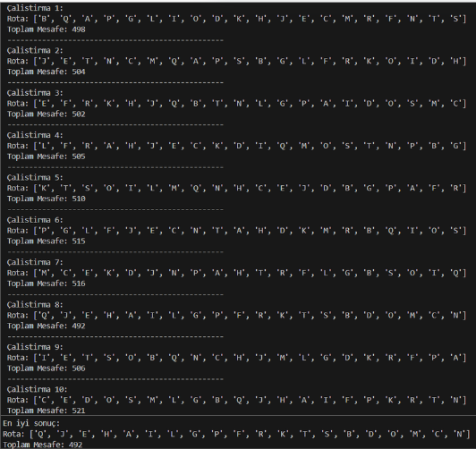
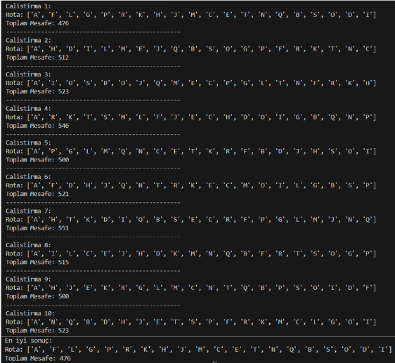

# 🗺️ Hill Climbing TSP

Bu proje, **Gezgin Satıcı Problemi (TSP)** için **Hill Climbing algoritmasını** kullanarak 20 şehirden oluşan bir rotada yaklaşık en kısa yolu bulmayı hedeflemektedir.

---

## 🧠 Algoritma Hakkında

**Hill Climbing**, bir başlangıç çözümünden başlayarak komşularını inceler ve daha iyi çözüme doğru adım adım ilerleyen sezgisel bir arama algoritmasıdır. Ancak yalnızca daha iyi çözümler varsa ilerler; bu nedenle yerel minimumlarda durabilir.

---

## 📁 Proje İçeriği

- 20x20 şehirler arası **mesafe matrisi**
- Şehir isimleri: A’dan T’ye
- Ana fonksiyonlar:
  - `random_route()` → Rastgele başlangıç rotası oluşturur
  - `route_distance()` → Bir rotanın toplam mesafesini hesaplar
  - `generate_neighbors()` → İki şehir yer değiştirerek komşu rotalar üretir
  - `hill_climbing()` → Daha iyi komşuları bularak toplam mesafeyi azaltmaya çalışır

---

## ⚙️ Fonksiyon Açıklamaları

### `distance(city1, city2)`
İki şehir arasındaki mesafeyi, mesafe matrisinden index kullanarak döndürür.

### `random_route()`
Gezginin yolculuğa başlaması için şehir listesini rastgele karıştırarak bir başlangıç rotası oluşturur.

### `route_distance(route)`
Verilen bir rotanın toplam mesafesini hesaplar. Gezginin başladığı şehre geri dönmesi sağlanır.

### `generate_neighbors(route)`
Her iterasyonda iki şehir yer değiştirerek yeni bir komşu rota oluşturur (swap işlemi). Bu sayede olası tüm komşular değerlendirilir.

### `hill_climbing()`
- Rastgele bir rota ile başlar.
- Komşular oluşturulur ve en iyisi seçilir.
- Eğer daha iyi bir komşu yoksa, algoritma durur (yerel minimuma ulaşılmış olabilir).

---

## 📊 Görsel Çıktılar

### 🔹 1. Tek çalıştırmadaki rota çıktısı:

### 🔹 2. Algoritma 10 kez çalıştırıldığında elde edilen sonuçlar:

---

## 📝 Notlar

- Hill Climbing algoritması deterministik değildir, bu nedenle başlangıç rotasına göre sonuçlar değişebilir.
- Yerel minimumlardan kaçınmak için algoritma farklı başlangıçlarla birden fazla kez çalıştırılabilir.

---

## 📌 Kaynaklar
- Sezgisel algoritmalar üzerine çeşitli akademik kaynaklar
- NumPy kütüphanesi ile Python’da matris işlemleri

---

