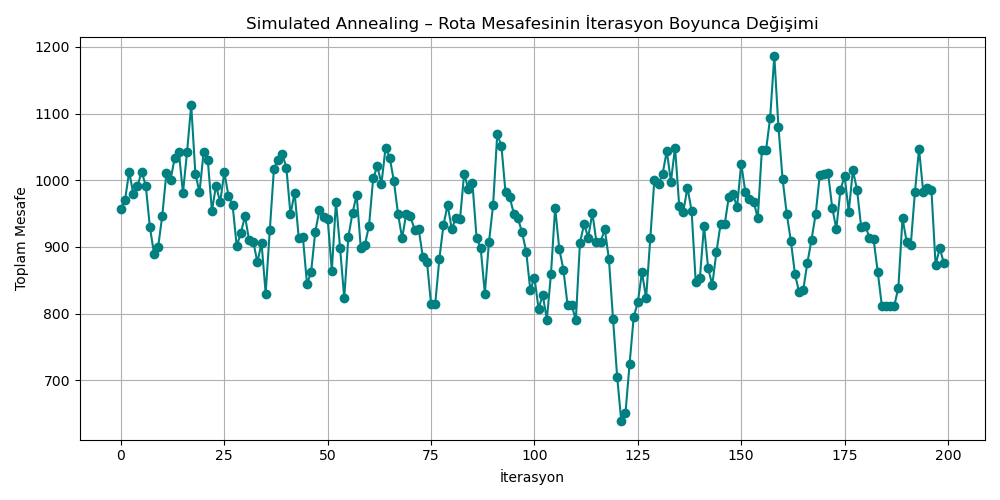

# 🗺️ Hill Climbing TSP

Bu proje, **Gezgin Satıcı Problemi (TSP)** için **Hill Climbing algoritmasını** kullanarak 20 şehirden oluşan bir rotada yaklaşık en kısa yolu bulmayı hedeflemektedir.

---

## 🧠 Algoritma Hakkında

**Hill Climbing**, bir başlangıç çözümünden başlayarak komşularını inceler ve daha iyi çözüme doğru adım adım ilerleyen sezgisel bir arama algoritmasıdır. Ancak yalnızca daha iyi çözümler varsa ilerler; bu nedenle yerel minimumlarda durabilir.

---

## 📁 Proje İçeriği

- 20x20 şehirler arası **mesafe matrisi**
- Şehir isimleri: A’dan T’ye
- Ana fonksiyonlar:
  - `random_route()` → Rastgele başlangıç rotası oluşturur
  - `route_distance()` → Bir rotanın toplam mesafesini hesaplar
  - `generate_neighbors()` → İki şehir yer değiştirerek komşu rotalar üretir
  - `hill_climbing()` → Daha iyi komşuları bularak toplam mesafeyi azaltmaya çalışır

---

## ⚙️ Fonksiyon Açıklamaları

### `distance(city1, city2)`
İki şehir arasındaki mesafeyi, mesafe matrisinden index kullanarak döndürür.

### `random_route()`
Gezginin yolculuğa başlaması için şehir listesini rastgele karıştırarak bir başlangıç rotası oluşturur.

### `route_distance(route)`
Verilen bir rotanın toplam mesafesini hesaplar. Gezginin başladığı şehre geri dönmesi sağlanır.

### `generate_neighbors(route)`
Her iterasyonda iki şehir yer değiştirerek yeni bir komşu rota oluşturur (swap işlemi). Bu sayede olası tüm komşular değerlendirilir.

### `hill_climbing()`
- Rastgele bir rota ile başlar.
- Komşular oluşturulur ve en iyisi seçilir.
- Eğer daha iyi bir komşu yoksa, algoritma durur (yerel minimuma ulaşılmış olabilir).

---
## ❄️ Simulated Annealing Yaklaşımı
Gezgin Satıcı Problemini ilk önce Hill Climbing algoritması ile çalıştırdım. Fakat yerel minimumlarda takılıp kaldığını fark ettim.
Bu noktada devreye Simulated Annealing ile geliştirme yaptım. Hill Climbing yalnızca daha iyi çözümleri kabul ederken, Simulated Annealing bazen daha kötü çözümleri de kabul ederiyor — ama neden?

Bu, algoritmanın yerel minimumlara takılmadan daha iyi çözümleri keşfetmesine olanak tanır.

---
## 🔍 Simulated Annealing Algoritması Nasıl Çalışır?
Başlangıçta yüksek bir "sıcaklık" (temperature) belirlenir.

Her iterasyonda:

Rastgele bir komşu rota oluşturulur.

Eğer yeni rota daha kısaysa → kabul edilir.

Daha uzunsa → yine de kabul edilebilir, ama belli bir olasılıkla (kabul kriteri).

Bu olasılık sıcaklık azaldıkça düşer.

Sıcaklık her adımda biraz daha düşürülür.

En sonunda algoritma “soğur” ve artık daha kötü çözümleri kabul etmez.

## 📉 Rota Mesafesi Gelişimi
Aşağıdaki grafik, algoritmanın zamanla rota mesafesini nasıl iyileştirdiğini gösteriyor:

Bu grafikte, rota mesafesinin nasıl azaldığı, bazen de yükseldiği (kötü adım) görülür. Bu davranış algoritmanın küresel minimuma ulaşma çabasıdır.

---
## 🧠 Sonuç

- Hill Climbing algoritması deterministik değildir, bu nedenle başlangıç rotasına göre sonuçlar değişebilir.
- Yerel minimumlardan kaçınmak için algoritma farklı başlangıçlarla birden fazla kez çalıştırılabilir.
- Simulated Annealing algoritması, Hill Climbing'in düştüğü yerel minimum tuzağını aşmak için güçlü bir alternatiftir. Proje ilerledikçe, daha gelişmiş meta-sezgisel algoritmalarla karşılaştırmalar yapmayı hedefliyorum.
---

## 📌 Kaynaklar
- Sezgisel algoritmalar üzerine çeşitli akademik kaynaklar
- NumPy kütüphanesi ile Python’da matris işlemleri

---

